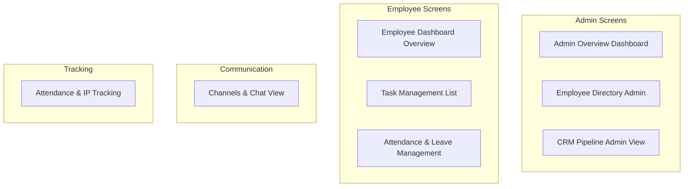

# Channels & Chat View - Design Documentation

> **Source**: Google Stitch Project  
> **Project ID**: `11507743319244493018`  
> **Device Type**: Mobile  
> **Theme**: Dark Mode | Inter Font | Custom Color `#13ec6d`

---

## Design System

### Theme Configuration

| Property | Value |
|----------|-------|
| **Color Mode** | Dark |
| **Font Family** | Inter |
| **Roundness** | 8px (Round) |
| **Primary Color** | `#13ec6d` |
| **Saturation** | 2 |

---

## Screens Overview

This project contains **8 screens** designed for a mobile enterprise application.

### 1. Channels & Chat View
- **ID**: `d4268b4542744f70bb8bfe6205846d1a`
- **Dimensions**: 780 × 1768
- **Device**: Mobile
- **Purpose**: Communication hub with channels and chat functionality

---

### 2. Employee Directory Admin
- **ID**: `236ae06b6e2e4ac8bdece7649e4763e9`
- **Dimensions**: 780 × 1864
- **Device**: Mobile
- **Purpose**: Admin view for managing employee directory and profiles

---

### 3. Attendance & Leave Management
- **ID**: `b607f3adff7e4a55839d0f5d95b99ab1`
- **Dimensions**: 780 × 1768
- **Device**: Mobile
- **Purpose**: Employee attendance tracking and leave request management

---

### 4. CRM Pipeline Admin View
- **ID**: `57885d98b3284f40a19dddbfff42d23b`
- **Dimensions**: 780 × 2218
- **Device**: Mobile
- **Purpose**: Customer relationship management with pipeline visualization

---

### 5. Admin Overview Dashboard
- **ID**: `1f0af37227f04fc59876bde8ee1253aa`
- **Dimensions**: 780 × 2356
- **Device**: Mobile
- **Purpose**: Main admin dashboard with key metrics and overview

---

### 6. Employee Dashboard Overview
- **ID**: `3577af4ddb7642cebe0af69f68be7a9e`
- **Dimensions**: 780 × 2348
- **Device**: Mobile
- **Purpose**: Employee-facing dashboard with personal metrics and tasks

---

### 7. Task Management List
- **ID**: `9520fc4b8e7e45fb87462938233f06b7`
- **Dimensions**: 780 × 1768
- **Device**: Mobile
- **Purpose**: Task listing and management interface

---

### 8. Attendance & IP Tracking
- **ID**: `c17a6f2f6e0741c6abe1c391c2906cda`
- **Dimensions**: 780 × 2150
- **Device**: Mobile
- **Purpose**: IP-based attendance tracking system

---

## Screen Categories

---

## Application Features

### Core Modules

1. **Communication**
   - Channels for team collaboration
   - Direct messaging / chat view

2. **HR Management**
   - Employee directory
   - Attendance tracking
   - Leave management
   - IP-based tracking

3. **Task Management**
   - Task lists
   - Employee dashboards

4. **CRM**
   - Pipeline management
   - Admin views

---

## Design Guidelines

### Color Palette

| Purpose | Color |
|---------|-------|
| Primary/Accent | `#13ec6d` (Vibrant Green) |
| Background | Dark Mode |
| Text | Light on Dark |

### Typography

- **Primary Font**: Inter
- **Usage**: All UI text, headings, and body copy

### Spacing & Roundness

- **Border Radius**: 8px for cards and buttons
- **Consistent spacing** following mobile-first design principles

---

## Technical Notes

- All screens are optimized for **mobile** viewport (780px width)
- Uses **dark mode** as default theme
- Consistent design language across all screens
- HTML code available for each screen via Stitch export
